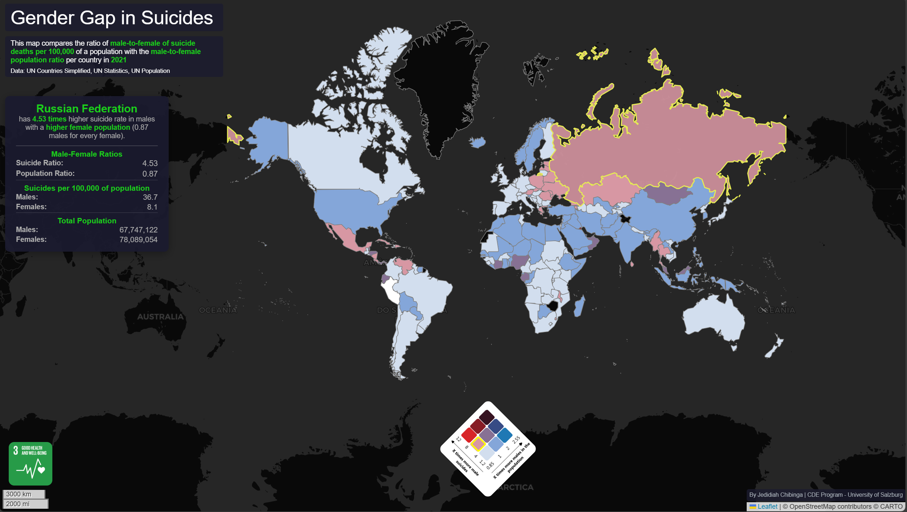

# The Gender Gap in Suicides: A Bivariate Analysis


> *Compare the gender gap in suicide rates against the gender population ratio globally.*

## Overview

This project is a visualisation that explores the relationship between two demographic variables for the year **2021**:

1.  **Male-to-Female Suicide Death Ratio** (per 100,000 population)
2.  **Male-to-Female Population Ratio**

Using a **bivariate choropleth map**, this visualisation highlights and compares gender disparities in suicide rates and the population gender balance in countries around the globe.

🔗 **[View Live Map](https://jayd0421.github.io/suicide_population_ratio_bivariate/)**

## Key Features

* **Bivariate Mapping**: Uses a colour-blending technique to represent two variables simultaneously on a single map.
* **Interactive Legend**: Includes a bivariate matrix legend (`images/bivariate-legend.png`) to interpret the color scales.
* **Global Coverage**: Data visualised at the country level.

## Data Sources
* **UN Countries Simplified**: Geospatial boundaries.
* **UN Statistics**: Suicide rate data.
* **UN Population**: Demographic population data.

## Repository Structure

```text
├── css/             # Stylesheets for map and layout
├── data/            # GeoJSON and statistical data files
├── icons/           # Map markers and UI icons
├── images/          # Static assets (legend, preview images)
├── js/              # JavaScript logic for map rendering and interaction
├── index.html       # Main entry point for the web application
└── README.md        # Project documentation
